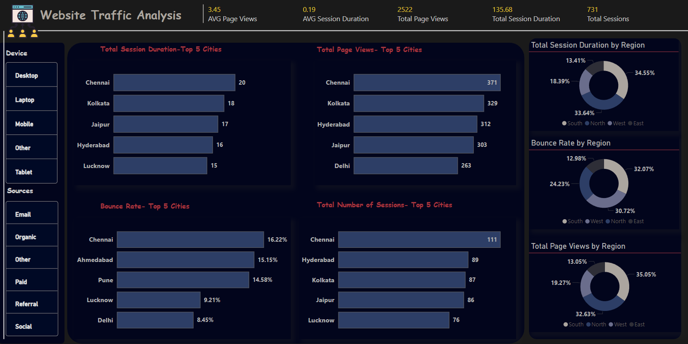

# Website Traffic Analysis Dashboard
This project is a Website Traffic Analysis Dashboard created using Power BI with data retrieved through SQL queries. The dashboard presents a comprehensive analysis of website traffic over time, including various metrics like session duration, page views, bounce rates, and traffic sources, segmented by devices, regions, and browsers.

## Overview
This dashboard provides a detailed view of website performance, focusing on user interactions across different devices, traffic sources, and regions. It is designed to help website owners and digital marketers understand user behavior, identify potential issues, and make data-driven decisions to improve engagement and optimize the user experience.

## Key Metrics Tracked:
**Session Duration:** Total and average time users spend on the website.   
**Bounce Rate:** The percentage of single-page sessions (where users left without interacting further).  
**Total Page Views:** Total number of pages viewed on the website over the analyzed period.  
**Traffic by Device Type:** Session statistics broken down by devices like desktop, mobile, tablet, and others.  
**Traffic Sources:** Page views, session duration, and bounce rate segmented by different traffic sources such as organic, email, social media, paid ads, etc.  
**Geographical Analysis:** Traffic, bounce rate, and page views by region and city.    

## Features
This dashboard includes the following visualizations and analysis points:

**1. Session Duration Trends**  
Overall Trend: Tracks the total session duration by quarter and month over the last two years.  
Device-Based Session Duration: Shows how session duration differs across devices (desktop, mobile, tablet, etc.).  
Region-Based Session Duration: Breaks down session duration by regions and cities, identifying top-performing locations.  

**2. Bounce Rate Analysis**  
Overall Bounce Rate Trends: Displays bounce rate changes over time (quarterly/monthly) to highlight user retention.  
Device-Specific Bounce Rates: Compares bounce rates across different devices to pinpoint where users might be disengaging.  
Content Segment Bounce Rates: Examines bounce rates across various content segments such as business, education, gaming, and tourism.  

**3. Page Views**  
Total Page Views: Shows the total number of pages viewed by users across all sessions.  
Page Views by Traffic Source: Compares page views generated from various sources like organic search, email campaigns, social media, and paid ads.  
Page Views by Device: Highlights how different devices contribute to total page views, helping to optimize for the best-performing devices.  

**4. Traffic Source Breakdown**  
Session Metrics by Source: Analyzes metrics like total sessions, session duration, and bounce rate for each traffic source (email, social, organic, referral, paid ads, etc.).  
Referral and Organic Performance: Provides insights into how well referral traffic and organic searches are contributing to overall website performance.  

**5. Geographical Insights**  
City-Wise Analysis: Shows traffic, session duration, page views, and bounce rate in top-performing cities like Chennai, Hyderabad, and Kolkata.  
Regional Analysis: Compares the performance across regions (North, South, East, West), helping identify potential markets for growth or focus.  

**6. Device and Browser Analysis**  
Device Type Usage: Compares how desktop, mobile, and tablet users engage with the website.  
Browser-Specific Metrics: Highlights bounce rates and session durations by browser type to identify any platform-specific issues.  

 
 
 

